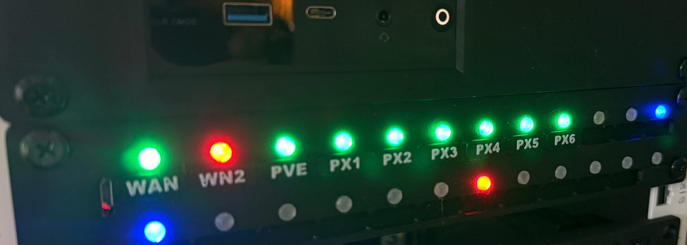

# Mini Rack Status LEDs

This repository will hold resources necessary to build and run a mini rack (10 inch) LED status panel using ESPHome and Home Assistant

## Needed

* [D1 Mini NodeMCU ESP32 ESP-WROOM-32](https://www.amazon.com/ACEIRMC-ESP-WROOM-32-Bluetooth-Development-Compatible/dp/B08PNWB81Z/ref=sr_1_2?crid=2BKRQ94IJ0EXL&dib=eyJ2IjoiMSJ9.HPkrBXa4SjJewGv3FYOW50OF0A3InLI_lo9QwKfCVRNjmYk5-vMHeuY0ujXF3m6vBLK0ybPxAm6_0XaKqZvIHRd7gVYh694Yxw5dfKYmrwfpPUvp9tzkUkwXapdohoedPnKKE4tjQN_CsMRsLW9z4ZFP1Cqy0mqdgXket2-ijePHlh9NzFdKzuTzDNR1cB_F7biuwQJxWfa2ooCaE2YPsvgk70skpCrSosm3rQQQI_w.gklQOxABu8zmqj0vaWu9qhSrNytbo2Wwa8xEoc98GPg&dib_tag=se&keywords=esp32%2Bd1%2Bmini%2Bblue&qid=1771528622&sprefix=esp32%2Bd1%2Bmini%2Bblu%2Caps%2C149&sr=8-2&th=1)
* [5V Buck to 3.3V Buck Converter Board](https://www.amazon.com/dp/B0BVFYXPQ8?ref=ppx_yo2ov_dt_b_fed_asin_title&th=1)
* [24 - LED WS2812B 5050 Light Board ](https://www.amazon.com/dp/B09FSTT43H?ref=ppx_yo2ov_dt_b_fed_asin_title)
* [5v/2A power supply](https://www.amazon.com/ALITOVE-100V-240V-Converter-5-5x2-1mm-Security/dp/B078RXZM4C/ref=sr_1_13_sspa?crid=12C24E9A66K2L&dib=eyJ2IjoiMSJ9.gUTJEZ5ceUaFuPvQbSE4w15RMJvgrjErGnfZVgT6gGcEk2nq8IfVFhmO7yQawpxOwtnE734fXIV-OU-vxy_QiKKDXo1ApODrKpFVf3mWCNx1gOr-LpkqWuNgmQKgOgJOrqEDIjF4z1Uq8Xg-tgpMIi7nXIDe9jdE6-09PUa4kqP-q0jcKMdN-_4ahqLm33OmZbc0RiYhrRzGOXmjysONLI5JIeQjjeJDVKNaYjmWl_ySjtmSSkBerhhUmnjSYY7TRhWpsclFT3ExoXFPWGwiwPPfmY7vMkF6Ax6rCzBQZ-Q.s_7SytghM_rlnnanYbbZtKEwlstBDw2lkB9xAOrg1uE&dib_tag=se&keywords=5v%2Bpower%2Bsupply&qid=1771529327&s=hi&sprefix=5v%2Bpow%2Ctools%2C133&sr=1-13-spons&sp_csd=d2lkZ2V0TmFtZT1zcF9tdGY&th=1)
* [DC Power Jack Socket](https://www.amazon.com/Fancasee-Female-Socket-Connector-Adapter/dp/B07Y8MFCJD/ref=sxin_17_pa_sp_search_thematic_sspa?content-id=amzn1.sym.11f03cd7-d882-4fed-ae42-aff13d15d142%3Aamzn1.sym.11f03cd7-d882-4fed-ae42-aff13d15d142&crid=2UIIOQ9YAEPTJ&cv_ct_cx=barrel+jack+female&keywords=barrel+jack+female&pd_rd_i=B07Y8MFCJD&pd_rd_r=61199a57-7dad-4dfd-9d35-388f12c3b877&pd_rd_w=4JbYP&pd_rd_wg=y0Lm5&pf_rd_p=11f03cd7-d882-4fed-ae42-aff13d15d142&pf_rd_r=GZDAN1N8DV22FGVYH2W8&qid=1771529847&sbo=RZvfv%2F%2FHxDF%2BO5021pAnSA%3D%3D&sprefix=barrel+jack+female%2Caps%2C164&sr=1-4-6e60e730-e094-43e9-99e8-1a4854cd27ff-spons&aref=BIHAu7IlQz&sp_csd=d2lkZ2V0TmFtZT1zcF9zZWFyY2hfdGhlbWF0aWM&psc=1)
* 3d printer to print the [mounting panel](https://makerworld.com/en/models/2420336-mini-rack-status-lights#profileId-2654340)
* 10 inch rack (of course)
* Home Assistant
* Some minor soldering skills

## Steps

* Print the [panel](images/mounting-panel-1.png)
* Provision your ESP32 [yaml included](rack-panel-leds.yaml)
* Solder everything together - [wiring diagram](images/wiring-diagram.png)
  * I like to use [solid core wires](images/solid-core-wires.png) in this type of application ([amazon link](https://www.amazon.com/dp/B08B8G2T5J?ref_=ppx_hzsearch_conn_dt_b_fed_asin_title_15&th=1))
* Add whatever automations you want to show status's (see [examples folder](/HA%20examples/))  
